# Overwatch 2 Project

A multi-page fan website for Overwatch 2 (Before they removed the 2...), built as a college assignment. The site covers game content across several pages - Heroes, Gallery, News, and more - with the centrepiece being a fully interactive, configurable quiz that tests player knowledge across five categories.

The live project can be accessed [here](https://markd117.github.io/Overwatch-Project/index.html)

<p align="center">
    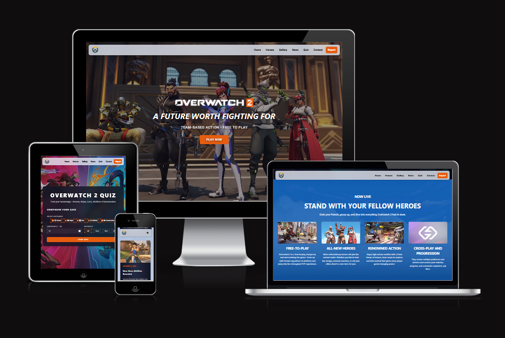
</p>

---

## Table of Contents

- [Overview](#overview)
- [Pages](#pages)
- [Page Features](#page-features)
  - [Home](#home)
  - [Heroes](#heroes)
  - [Gallery](#gallery)
  - [News](#news)
  - [Contact](#contact)
  - [Quiz](#quiz)
  - [Report](#report)
  - [Privacy Policy](#privacy-policy)
  - [Terms of Service](#terms-of-service)
  - [404](#404)
- [Project Structure](#project-structure)
- [Technologies Used](#technologies-used)
- [Deployment](#deployment)
- [How to Run Locally](#how-to-run-locally)

---

## Overview

This project is a fan site for Overwatch built with plain HTML, CSS, and vanilla JavaScript - no frameworks or build tools required. It is a Semester 2 Web Development with AI assignment.

The site is fully responsive and uses a shared header and footer loaded dynamically via W3.js's `includeHTML` utility, so navigation is consistent across all pages.

---

## Pages

| Page | File | Description |
|---|---|---|
| Home | `index.html` | Landing page with hero video, intro section, game info cards, and latest update |
| Heroes | `heroes.html` | Filterable roster of all Overwatch 2 heroes with role and headshot |
| Gallery | `gallery.html` | Image gallery of in-game screenshots |
| News | `news.html` | News articles and patch update summaries |
| Quiz | `quiz.html` | The main interactive quiz (see below) |
| Contact | `contact.html` | Contact form |
| Report | `report.html` | Project report / documentation page |
| Privacy | `privacy.html` | Privacy policy |
| Terms | `terms.html` | Terms of service |
| 404 | `404.html` | Custom 404 error page |

---

## Page Features

### Home

<p align="center">
    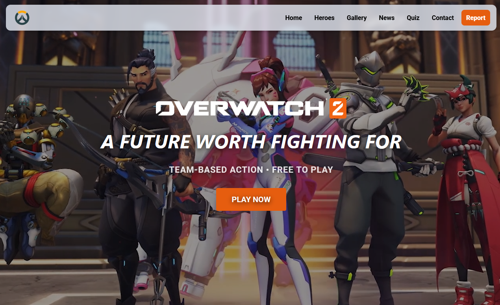
</p>

- Full-screen **background video** hero section with the Overwatch logo and a call-to-action button
- **Intro section** with an embedded YouTube trailer
- **Update section** highlighting the latest season content with a second embedded video
- **Game info cards** covering Free-to-Play, All-New Heroes, Renowned Action, and Cross-Play

### Heroes

<p align="center">
    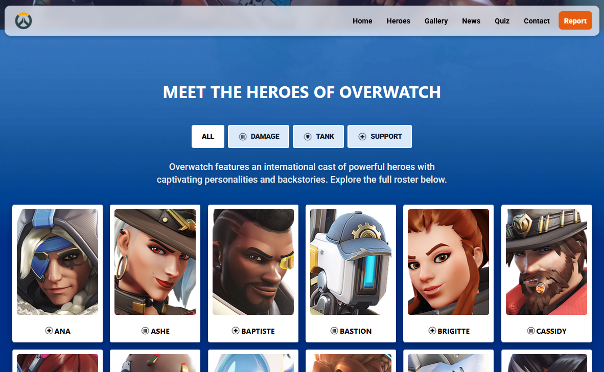
</p>

- Full **hero roster** displaying all 40+ heroes, each with their headshot and role icon
- **Role filter buttons** (All, Damage, Tank, Support) that show/hide hero cards dynamically
- **Role description** that updates when a filter is selected, explaining the chosen role
- Responsive grid layout: 6 columns on desktop, 4 on tablet, 2 on mobile

### Gallery

<p align="center">
    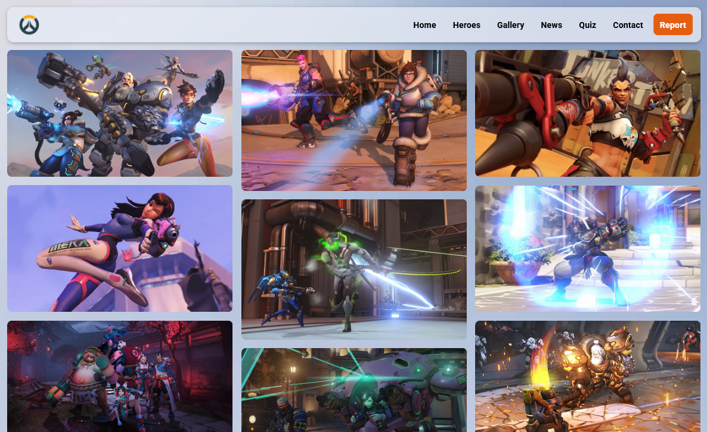
</p>

- **Masonry-style 3-column photo grid** with 18 in-game screenshots
- `loading="lazy"` applied to images below the fold for faster initial load

### News

<p align="center">
    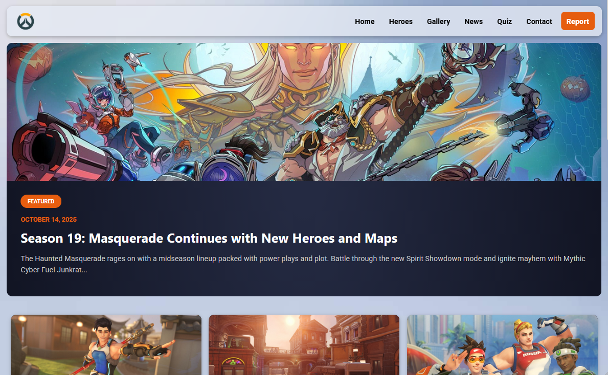
</p>

- **Featured news banner** with a large image, badge, date, title, and excerpt
- **News card grid** with 6 articles covering hero updates, balance changes, events, esports, community spotlights, and developer insights
- Each card shows a thumbnail, date, title, and excerpt

### Contact

<p align="center">
    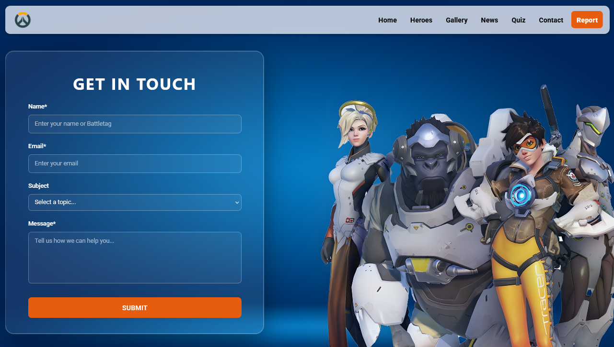
</p>

- Contact form with fields for **Name**, **Email**, **Subject** (dropdown), and **Message**
- Required field validation on Name, Email, and Message
- On submission, displays a confirmation alert and redirects to the home page

---

### Quiz

<p align="center">
    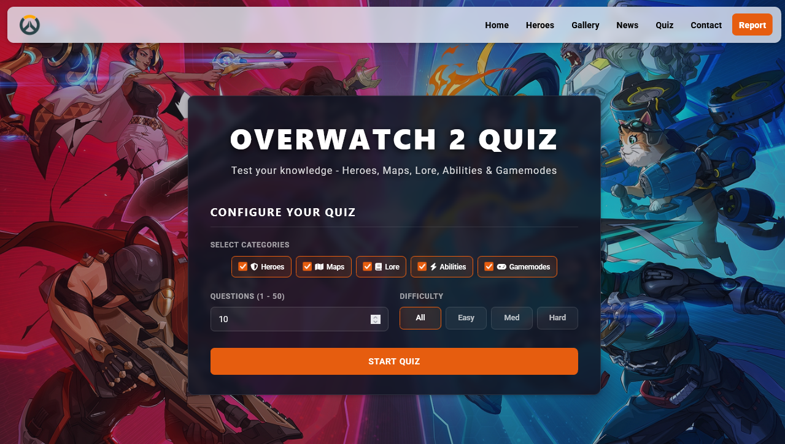
</p>

The quiz is the core feature of the project, built entirely in vanilla JavaScript (`scripts/quiz.js`) with questions loaded from `data/questions.json`.

#### Setup Screen
- **Category selection** - choose any combination of: Heroes, Maps, Lore, Abilities, Gamemodes
- **Question count** - enter any number from 1 to 50 (validated live on input)
- **Difficulty filter** - All, Easy, Medium, or Hard

#### Question Screen
- Questions are randomly shuffled using the Fisher-Yates algorithm
- Live **countdown timer** displayed as MM:SS
- **Progress bar** and "Question X of Y" indicator
- **Category/difficulty badge** shown per question
- Four multiple-choice options rendered dynamically from JSON
- If fewer questions exist than requested, the quiz adjusts and notifies the player

#### Results Screen
- **Score** (correct / total)
- **Percentage** (colour-coded: green ≥ 70%, amber ≥ 40%, red < 40%)
- **Total time** and **average time per question**
- **Category breakdown table** - attempted, correct, and score % per category, colour-coded by performance
- **Answer review** - full question-by-question review with correct/incorrect highlighting
- **Save score** - saves name + result to `localStorage`
- **Leaderboard** - sorted by percentage (fastest time breaks ties), persisted in `localStorage`, pre-seeded with default Overwatch-themed entries
- **Clear leaderboard** - resets to default entries after confirmation

### Report

<p align="center">
    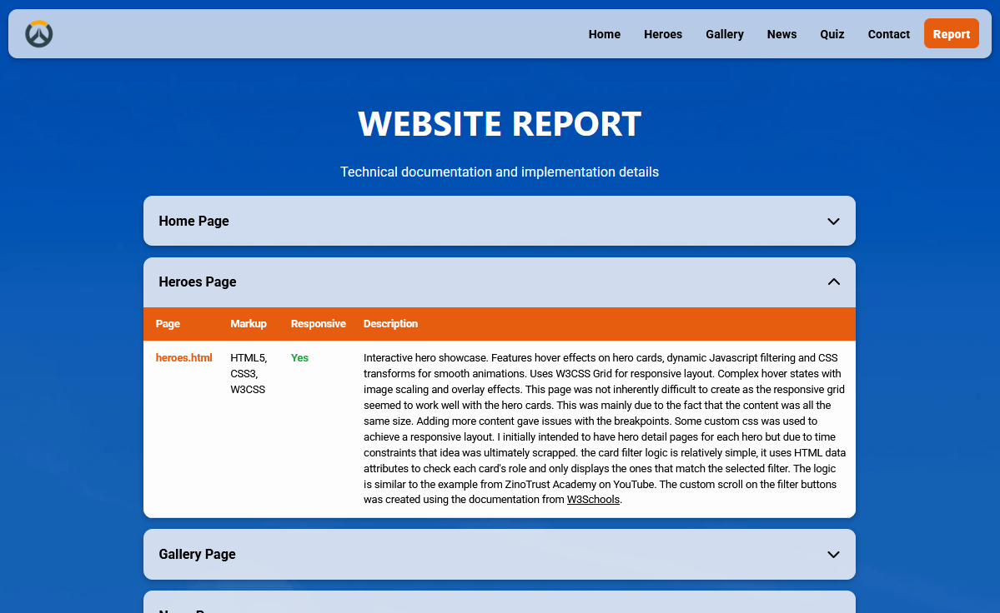
</p>

- Technical documentation page covering every page of the site
- **Interactive accordion** interface — each page has its own collapsible section
- Each accordion entry contains a table with markup used, responsiveness, and a detailed description
- Accordion open/close powered by JavaScript toggle with a rotating chevron icon

### Privacy Policy

<p align="center">
    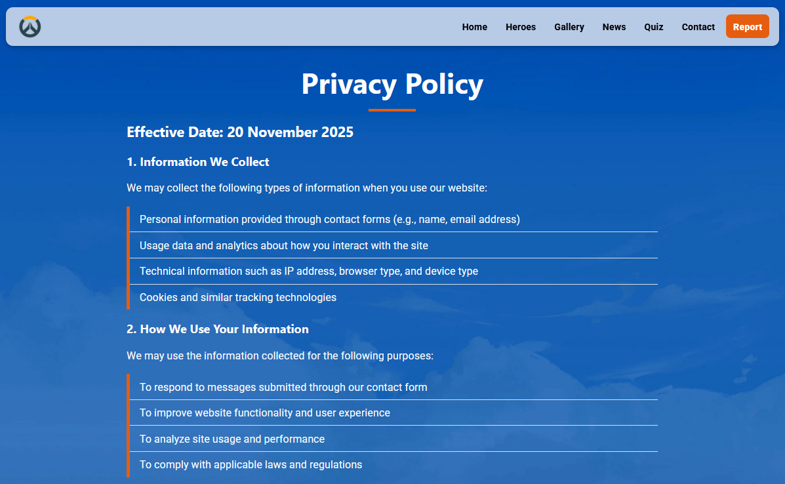
</p>

- Standard privacy policy with 10 numbered sections covering data collection, usage, sharing, security, cookies, third-party links, children's privacy, user rights, and contact info
- Includes a disclaimer noting this is a student project for educational purposes only
- Styled with W3.CSS and an orange accent colour to match the site theme

### Terms of Service

<p align="center">
    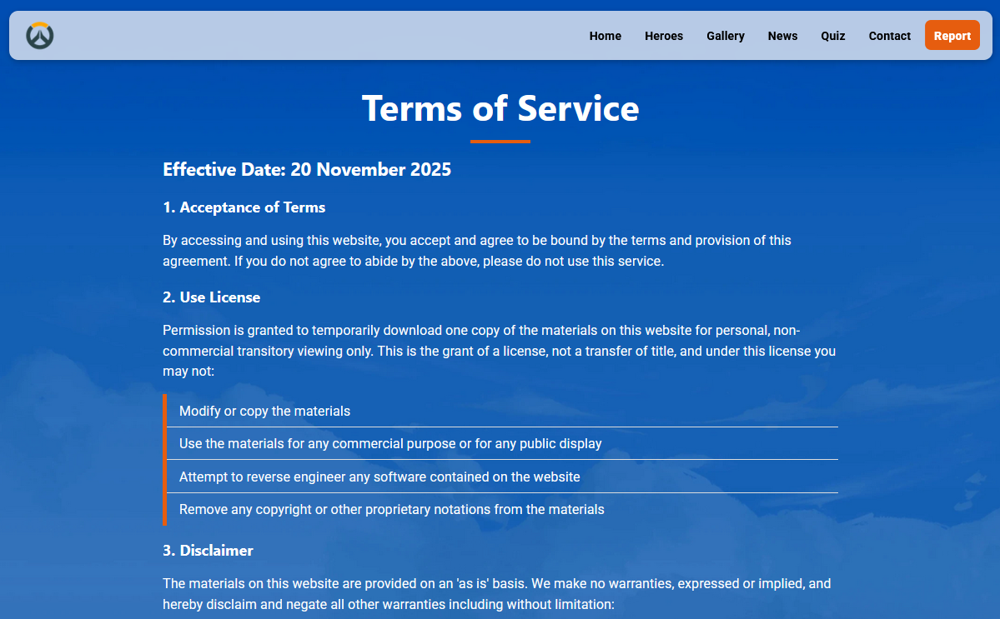
</p>

- Terms of service with 11 numbered sections covering use license, disclaimers, limitations, accuracy, links, modifications, governing law (Ireland), user conduct, and termination
- Matches the Privacy Policy page layout and styling
- Includes an educational disclaimer for student project context

### 404

<p align="center">
    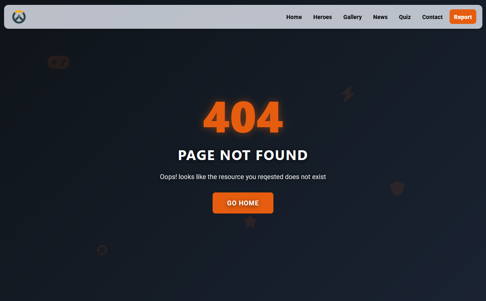
</p>

- Custom Overwatch-themed error page with a large **404** heading and "Page Not Found" message
- **Animated floating icons** (gamepad, shield, crosshairs, bolt, star) using CSS keyframe animations
- A "Go Home" button returns the user to the home page

---

## Project Structure

```
├── index.html              # Home page
├── heroes.html             # Heroes roster
├── gallery.html            # Screenshot gallery
├── news.html               # News page
├── quiz.html               # Quiz page
├── contact.html            # Contact page
├── report.html             # Project report
├── privacy.html            # Privacy policy
├── terms.html              # Terms of service
├── 404.html                # Custom 404 page
│
├── scripts/
│   └── quiz.js             # All quiz logic
│
├── data/
│   └── questions.json      # Quiz question bank (category, difficulty, options, correctIndex)
│
├── includes/
│   ├── header.html         # Shared navigation bar
│   └── footer.html         # Shared footer
│
├── static/
│   ├── css/
│   │   ├── style.css       # Custom styles
│   │   └── w3.css          # W3.CSS framework
│   └── js/
│       └── w3.js           # W3.js utilities (includeHTML)
│
└── media/
    ├── favicon.ico
    ├── images/             # All site images (heroes, gallery, news, etc.)
    └── videos/             # Background video assets
```

---

## Technologies Used

- **HTML5** - semantic markup across all pages
- **CSS3** - custom styles in `style.css`
- **[W3.CSS](https://www.w3schools.com/w3css/)** - lightweight CSS framework for layout and responsive grid
- **Vanilla JavaScript** - all interactivity, no libraries or frameworks
- **[Font Awesome](https://fontawesome.com/)** - icons throughout the UI
- **[Google Fonts](https://fonts.google.com/)** - Roboto typeface
- **localStorage** - leaderboard persistence, no backend required

---

## Deployment

The site is deployed using [GitHub Pages](https://pages.github.com/) and is accessible at:

**https://markd117.github.io/Overwatch-Project/**

It is served directly from the `main` branch with no build step required.

---

## How to Run Locally

This is a static site - no installation or build step is needed.

1. Clone the repository:
   ```bash
   git clone https://github.com/MarkD117/Overwatch-Project.git
   ```
2. Open `index.html` in your browser.

> **Note:** The shared header and footer use `fetch` under the hood via W3.js `includeHTML`. To load them correctly, serve the project through a local server rather than opening the file directly. A simple option is the [Live Server](https://marketplace.visualstudio.com/items?itemName=ritwickdey.LiveServer) VS Code extension.
